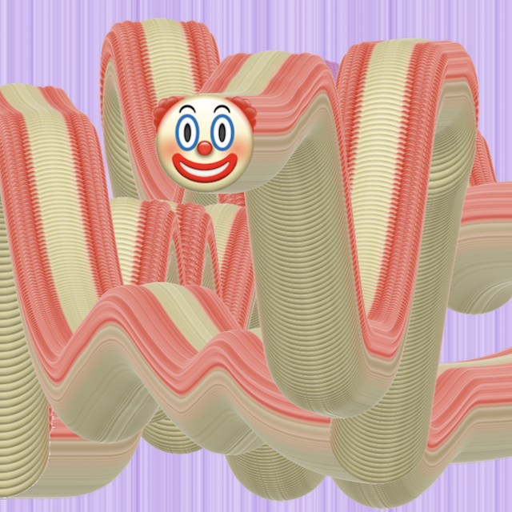

# Exercise 1 - Moving Pictures

__Grade__: 2.5% of final grade (see grading guidelines at bottom)  
__Deadline__: 11:59PM on the day of class on week of 30 October 2017.

## Brief

Create an even more bizarre and surreal collection of moving images by adding your own images and motions to the existing set.

## Learning objectives

- Get comfortable adding code to an existing script
- Remember to add comments when you add/change code
- Using Git, GitHub Desktop, and GitHub to track and submit your code



## Challenges

1. __Add an image or shape__ that starts off the left side of the canvas and moves from left to right across the canvas when the program runs.
2. __Add an image__ that is always displayed at the current mouse location.
3. __Add an image or shape__ that also follows the mouse but at a different speed from the clown face.

(Optional challenge: add an image that moves across the screen according to a sine wave.)

## Starter Code

[exercise1.zip](exercise1.zip)

`script.js`:
```javascript
/*****************

Exercise 1 - Moving pictures
Pippin Barr

Starter code for exercise 1.
It moves two pictures around on the canvas.
One moves linearly down the screen.
One moves toward the mouse cursor.

******************/

// The image of a clown face
var clownImage;
// The current position of the clown face
var clownImageX;
var clownImageY;

// The transparent image of "felt" that wipes down the canvas
var feltTextureImage;
// The current position of the transparent image of "felt"
var feltTextureImageX;
var feltTextureImageY;


// preload()
//
// Load the two images we're using before the program starts

function preload() {
  clownImage = loadImage("assets/images/clown.png");
  feltTextureImage = loadImage("assets/images/black-felt-texture.png");
}


// setup()
//
// Set up the canvas, position the images, set the image mode.

function setup() {
  // Create our canvas
  createCanvas(640,640);

  // Start the clown image at the centre of the canvas
  clownImageX = width/2;
  clownImageY = height/2;

  // Start the felt image perfectly off screen above the canvas
  feltTextureImageX = width/2;
  feltTextureImageY = 0 - feltTextureImage.height/2;

  // We'll use imageMode CENTER for this script
  imageMode(CENTER);
}


// draw()
//
// Moves the felt image linearly
// Moves the clown face by lerping it toward the mouse location

function draw() {

  // Move the felt image down by increasing its y position
  feltTextureImageY += 1;

  // Display the felt image
  image(feltTextureImage,feltTextureImageX,feltTextureImageY);

  // Move the clown by moving it 1/10th of its current distance from the mouse

  // Calculate the distance in X and in Y
  var xDistance = mouseX - clownImageX;
  var yDistance = mouseY - clownImageY;
  // Add 1/10th of the x and y distance to the clown's current location
  clownImageX = clownImageX + xDistance/10;
  clownImageY = clownImageY + yDistance/10;

  // Display the clown image
  image(clownImage,clownImageX,clownImageY);
}
```


## Submission

You will submit this exercise as a __comment__ on an __Issue__ on the course repository here:

https://github.com/pippinbarr/cart253-2018/issues

(Click on the Issue with the name of the exercise and your section letter and follow the instructions.)


## Grading

Grading for exercises will consider the following categories equally:

- __Runs__ and __implements the challenges required__
- Has __suitable commenting for all added/changed code__
- Includes a minimum of one initial commit of the template code, and __one commit message per challenge addressed__, all commits must have a __descriptive message__
- Uses __good naming__ for added variables
- Is __well structured__, with new code added in sensible places in sensible orders

Each element is equally weighted in your the grade for the exercise and will be graded as follows:

- __Excellent__ (A / 100%) - Meets requirements perfectly
- __Good__ (B / 75%) - Meets requirements with some minor issues
- __Adequate__ (C / 50%) - Meets requirements but with clear issues
- __Poor__ (D / 25%) - Barely meets requirements
- Non-submission / Unacceptable (F / 0%)
