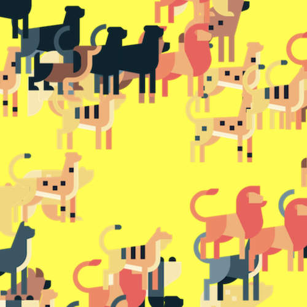

# Exercise 3 - Where's Sausage Dog Plus

__Grade__: 2.5% of final grade (see grading guidelines at bottom)  
__Deadline__: 11:59PM on the day of class on week of 1 October 2018.

## Brief

Modify the Where's Sausage Dog game to improve it

## Learning objectives

- Improving interface designs
- Using loops for visual effects

## Challenges

As always, begin by downloading the start code ([exercise3.zip](exercise3.zip)). Add it to your repository and commit it as "Ex3: Started exercise 3". Then complete and commit each challenge below separately with a descriptive commit messages (including the exercise prefix). Remember to comment your work.

1. Improve the user interface of the game by displaying the image you're searching for in the top right corner against a coloured background rectangle.
2. Add a caption to the image you just added that serves as an instruction, like "CHIEN PERDU" or "Where am I?" or something.
3. Change the code that positions the sausage dog to make sure it can never be positioned __underneath__ the user interface element you just created. You'll need to use a `while` loop to keep generating a random location for the dog (`targetX` and `targetY`) until it's no inside the area defined by the interface element.
4. Make winning more exciting than it is now. Make the sausage dog move around on the screen when you've won (clearly it will now need velocity variables and a speed variable, probably screen wrap). Maybe turn off the `background()` drawing so it leaves a trail? Maybe it can shrink and grow as well?
5. Tune the game's difficulty to a level you like by changing how large the images are displayed (remember you can set height and width in `image()`) and how many there are. (You could even randomise both of these if you want.)

Optional challenge: If you're advanced and know about arrays, can you work out how to use a __random__ image as the one the player is looking for? Can you add a restart button at the end so that the player can try again with a new image? Can you add a difficulty setting that changes (for example), the number and size of the images to make the game harder or easier?

## Starter Code

[exercise3.zip](exercise3.zip)

## Submission

You will submit this exercise as a __comment__ on an __Issue__ on the course repository here:

https://github.com/pippinbarr/cart253-2018/issues

(Click on the Issue with the name of the exercise and your section letter and follow the instructions.

## Grading

Grading for exercises will consider the following categories equally:

- __Runs__ and __implements the challenges required__
- Has __suitable commenting for all added/changed code and functions__
- Includes a minimum of one initial commit of the template code, and at least __one commit message per challenge addressed__, all commits must have a __descriptive message__ prefixed with "Ex3"
- Uses __good naming__ for added variables and functions
- Is __well structured__, with new code added in sensible places in sensible orders, uses functions where appropriate to keep code organised

Each element is equally weighted in your the grade for the exercise and will be graded as follows:

- __Excellent__ (A / 100%) - Meets requirements perfectly
- __Good__ (B / 75%) - Meets requirements with some minor issues
- __Adequate__ (C / 50%) - Meets requirements but with clear issues
- __Poor__ (D / 25%) - Barely meets requirements
- __Non-submission / Unacceptable__ (F / 0%)
