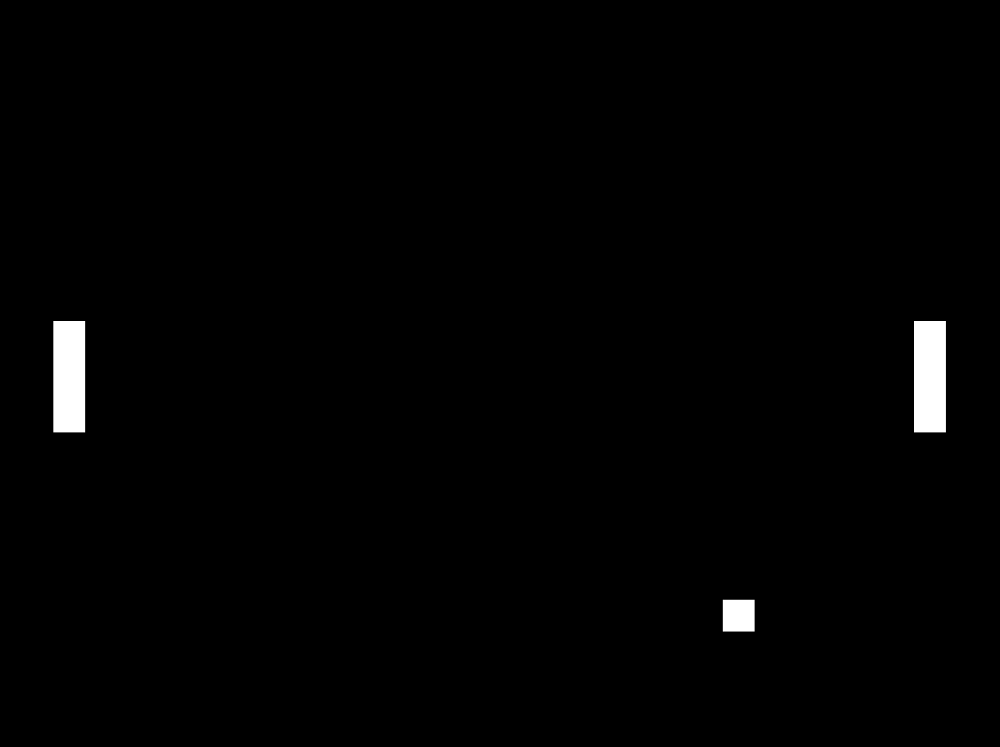

# Exercise 5 - Pong Plus (Object-Oriented Edition)

__Grade__: 2.5% of final grade (see grading guidelines at bottom)  
__Deadline__: 11:59PM on the day of class on week of 22 October 2018.

## Brief

Modify the OOP version of the Pong game to recreate your [Exercise 4](Exercise-4.md) version.

## Learning objectives

-

## NEW: Commenting your changes clearly

For this exercise and all future exercises you must add a comment above and below any new code you add or code you change in your program to indicate it is something to be graded. (See [Exercise 4](Exercise-4.md) text for an example.)

## Challenges

As always, begin by downloading the starter code ([exercise5.zip](exercise5.zip)). Add it to your repository and commit it as "__Ex5: Started exercise 5__". Then complete and commit each challenge below separately with a descriptive commit messages (__including the exercise prefix "Ex5:"__). Remember to comment your work.

This week, the challenge is to recreate your [Exercise-4](Exercise-4.md) version of Pong in the new Object-Oriented version of Pong represented by the starter code. This will mean:

- Tracking the score (consider the idea of having the Ball's `isOffScreen()` function either return which side of the screen it went off, or neither if it's still on screen - you could represent this with numbers or strings)
- Displaying the score
- Launching the ball with a random y velocity toward the paddle that won the most recent point
- Altering the visuals as per your previous version

In short, make the object-oriented version look and feel the same as the non-object-oriented version you made last week.

Optional challenges: Feel free to pursue last week's optional challenges in this new context.

## Starter Code

[exercise5.zip](exercise5.zip)

## Submission

You will submit this exercise as a __comment__ on an __Issue__ on the course repository here:

https://github.com/pippinbarr/cart253-2018/issues

(Click on the Issue with the name of the exercise and your section letter and follow the instructions.)

## Grading

Grading for exercises will consider the following categories equally:

- __Runs__ and __implements the challenges required__
- Has __suitable commenting for all added/changed code and functions__
- Includes a minimum of one initial commit of the template code, and at least __one commit message per challenge addressed__, all commits must have a __descriptive message__ prefixed with "Ex5: "
- Uses __good naming__ for added variables, functions, and object properties and methods
- Is __well structured__, with new code added in sensible places in sensible orders, uses functions and objects where appropriate to keep code organised, uses new files for new classes

Each element is equally weighted in your the grade for the exercise and will be graded as follows:

- __Excellent__ (A / 100%) - Meets requirements perfectly
- __Good__ (B / 75%) - Meets requirements with some minor issues
- __Adequate__ (C / 50%) - Meets requirements but with clear issues
- __Poor__ (D / 25%) - Barely meets requirements
- __Non-submission / Unacceptable__ (F / 0%)
